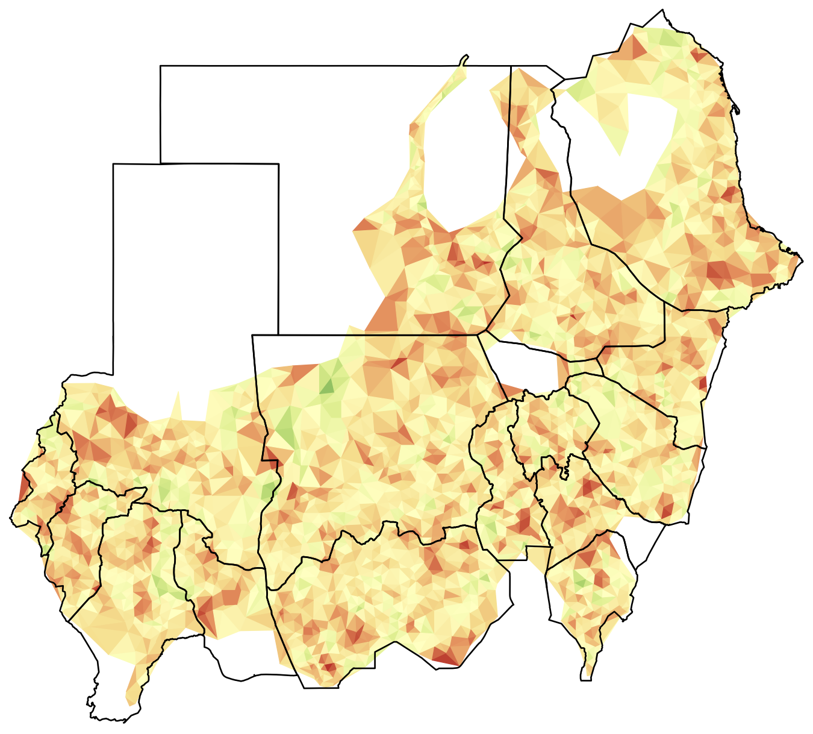

--- 
title: "Mapping with R"
author: "Ernest Guevarra"
date: "`r Sys.Date()`"
knit: bookdown::render_book
site: bookdown::bookdown_site
documentclass: book
geometry: margin=2cm
classoption: a4paper
bibliography: ["book.bib"]
biblio-style: "apalike"
link-citations: TRUE
links-as-notes: FALSE
subparagraph: TRUE
colorlinks: TRUE
linkcolor: blue
citecolor: blue
urlcolor: blue
fontsize: 12pt
always_allow_html: yes
url: https\://validmeasures.org/map-r
cover-image: figures/sudanMapTriSim.png
description: "Mapping with R"
---

```{r, echo = FALSE, warning = FALSE, message = FALSE}
knitr::opts_chunk$set(
  warning = FALSE,
  message = FALSE,
  collapse = TRUE,
  comment = "#>",
  fig.path = "figures/"
)

options(stringsAsFactors = FALSE)

if(!require(devtools)) install.packages("devtools")
if(!require(rgdal)) install.packages("rgdal")
if(!require(rgeos)) install.packages("rgeos")
if(!require(raster)) install.packages("raster")
if(!require(spatialsampler)) install_github("validmeasures/spatialsampler")
if(!require(liberia)) install_github("validmeasures/liberia")
if(!require(maps)) install.packages("maps")
if(!require(knitr)) install.packages("knitr")
if(!require(kableExtra)) install.packages("kableExtra")
if(!require(magrittr)) install.packages("magrittr")
if(!require(FNN)) install.packages("FNN")
```

# Short course on the use of R for the mapping requirements of S3M {-}

<center></center>
